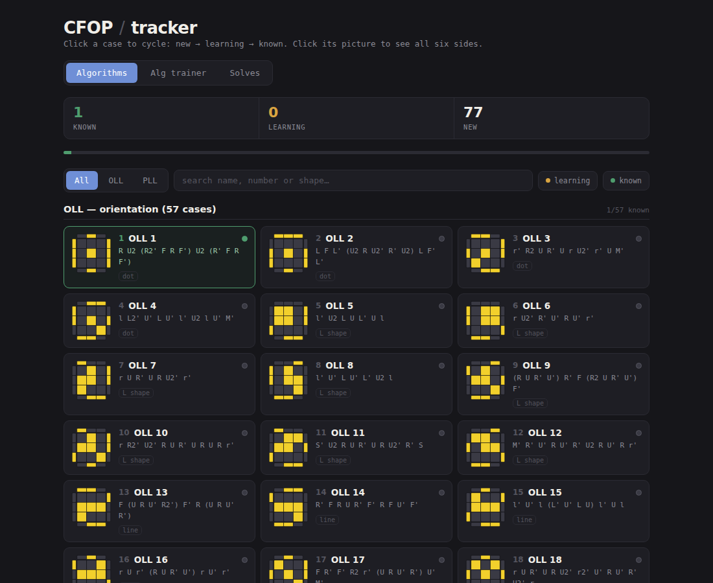
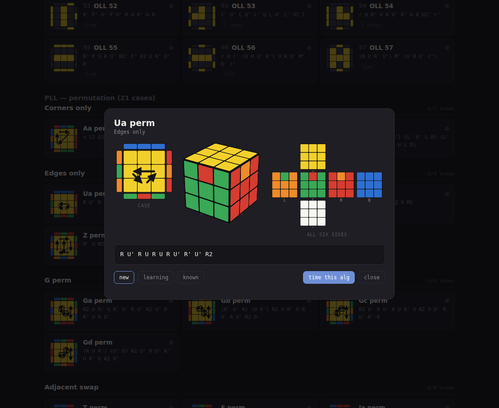
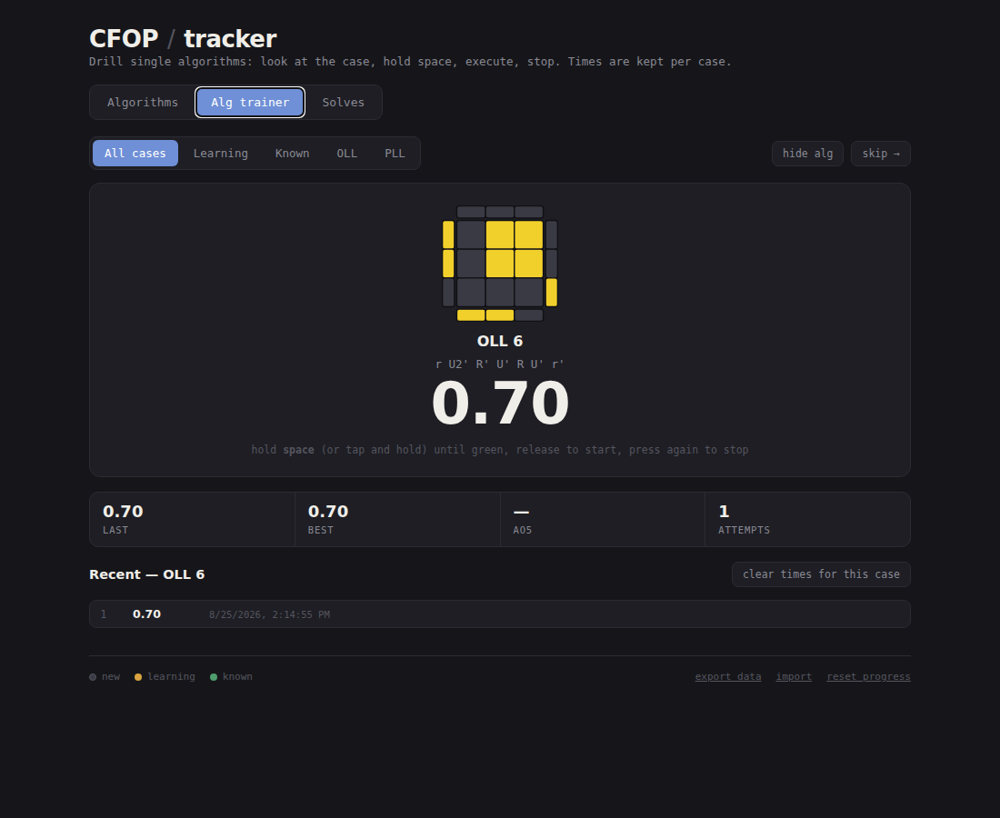
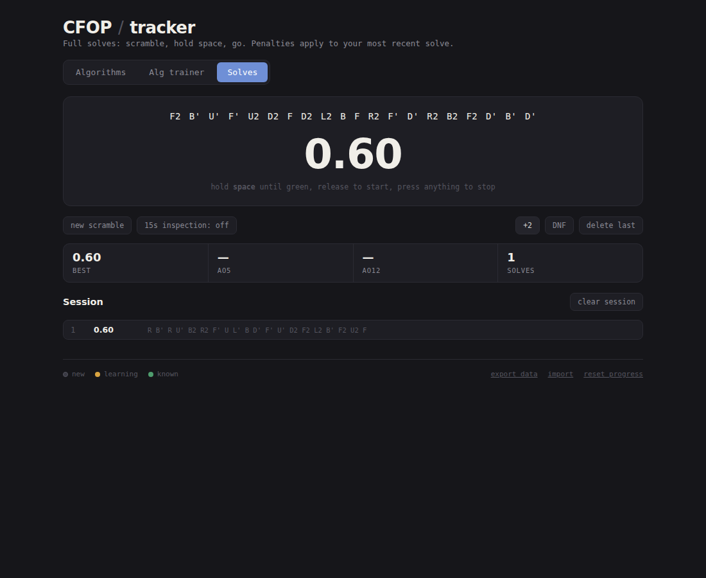

# CFOP tracker

A single-page tracker for the 57 OLL and 21 PLL cases, with a picture of every
case and a timer for both single algorithms and full solves. No build step, no
dependencies at runtime — open `index.html` and it works, online or offline.



## What it does

**Track what you know.** Click a case to cycle it through new → learning →
known. Progress, times and settings live in `localStorage`, and there is an
export/import button so you can move them between browsers.

**See every case.** Each card carries the standard top-down diagram: for OLL,
yellow stickers against grey; for PLL, the real side colours plus arrows
showing which pieces swap. Click the diagram for a bigger view with the full
2D map of all six sides and a 3D cube you can drag around.



**Time single algorithms.** The alg trainer deals you a random case from a
scope you pick (everything, just what you're learning, just OLL, …), times your
execution, and keeps best/ao5/attempt counts per case. "Time this alg" in the
detail view pins one case so you can drill it.



**Time full solves.** Random-state-free but properly deduplicated 20-move
scrambles, optional 15 second inspection with the usual +2/DNF thresholds,
session list with penalties, and best/ao5/ao12 across the session.



Hold **space** until the timer turns green, release to start, press anything to
stop. On a phone, hold anywhere on the timer panel instead.

## The diagrams are generated, not drawn

There is no image library and no hand-entered sticker data. To draw a case,
`js/cube.js` applies the *inverse* of its algorithm to a solved cube and reads
the stickers off the result. That means a picture can only be wrong if its
algorithm is wrong — so the test suite checks exactly that:

```bash
npm run verify   # every alg must solve the case it generates; no two cases alike
npm run smoke    # loads the page in Chromium and drives the timer
npm test         # both
```

`npm run verify` is worth running after editing `js/algs.js`. It caught two bad
algorithms (Ab perm and Z perm) in the original list this project grew out of.

If you prefer different algorithms — and you will, the finger tricks that suit
you are personal — edit `js/algs.js` and run `npm run verify`. Everything else,
including the diagrams, follows automatically.

## Running it

Open `index.html` directly, or serve the folder:

```bash
npm start        # http://localhost:8080
```

Pushing to `main` publishes the site to GitHub Pages via
`.github/workflows/pages.yml` (enable Pages → Source: GitHub Actions in the
repository settings once).

## Layout

| File | What's in it |
| --- | --- |
| `js/cube.js` | 3x3 cube model: moves, wide turns, slices, rotations, scrambles |
| `js/algs.js` | The case list — ids, names, algorithms |
| `js/render.js` | SVG case diagram, unfolded net, CSS 3D cube |
| `js/store.js` | localStorage persistence and WCA-style averages |
| `js/timer.js` | The stopwatch: hold-to-arm, inspection, formatting |
| `js/app.js` | Views, cards, detail modal, trainer, solve timer |
| `tools/` | The two test scripts |

## Licence

MIT — see [LICENSE](LICENSE).
